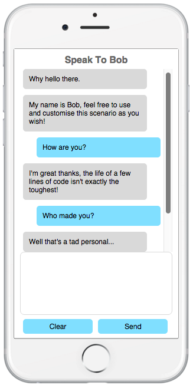

-------------------------------------------------------
iOS Messaging Scenario For The Web - OPEN SOURCE
-------------------------------------------------------

Developer: Steven Basher  
Version: 1.0  
Date: 08.01.16  

-------------------------------------------------------

###PREVIEW

###CONTENTS

./index.php - The PHP page containing the scenario and corresponding logic  
./response.php - An example response script to handle user's input  
./images/iphone6s.png - Background image for the scenario (Credit: http://p-px.com/iphone-6s/)  

###USAGE

This is a text / messaging scenario which is useful for prototyping iOS text-based apps, creating a UX for a chatbot or any other reason you may have! Upload the files to a server and visit index.php for a demonstration. It is incredibly lightweight and I have documented the code throughout so it should be very easy to edit to your liking.

Feel free to use for Personal / Commercial use, just please give me a shout in the credits / message me so I know what you're doing, I love other people using my work! 

Originally developed to prototype a project of my own, I have now released this as my first official (yet tiny) open-source program. 